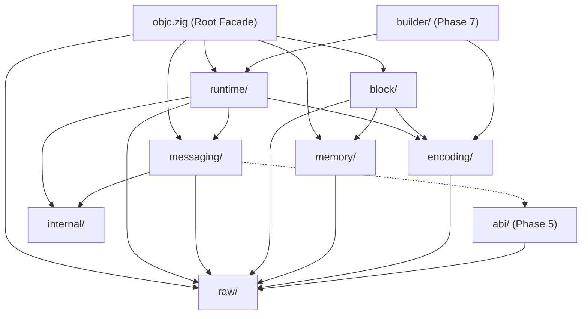

# Architecture and Module Boundaries

## 1. Project Goals

`zobjc` provides high-performance, idiomatic, type-safe Zig bindings for the Apple Objective-C runtime.
The architecture is strictly organized into decoupled subsystems where each layer has a single, well-defined responsibility and dependencies point strictly downward toward the low-level runtime ABI (`raw`).

---

## 2. Layer Diagram

---

## 3. Subsystem Responsibilities

| Subsystem | Responsibility | Phase Introduced / Redesigned |
| :--- | :--- | :---: |
| `raw/` | Exact Objective-C runtime ABI declarations (`objc.raw.runtime.*`). Direct underlying C calls without convenience behavior, memory policies, or conversions. | Phase 1 |
| `runtime/` | Typed Objective-C runtime entities: `Object`, `Class`, `Selector`, `Method`, `Ivar`, `Property`, `Protocol`, `Imp`. Conceptual wrappers around runtime handles. Does not own ABI dispatch decisions. | Phase 2 |
| `memory/` | Ownership and memory management: `AutoreleasePool`, `Retained(T)`, `Weak(T)`, `OwnedRuntimeList(T)`, `OwnedCString`, `OwnedMethodDescriptions`, `OwnedPropertyAttributes`, `OwnedCStringList`. (See [docs/ownership.md](file:///Users/burakssen/dev/personal/apple/zobjc/docs/ownership.md)). | Phase 3 |
| `encoding/` | Objective-C type encodings: `comptimeEncode(T)`, AST representations, recursive-descent type and method parser, callback validation, and property attributes. (See [docs/encoding.md](file:///Users/burakssen/dev/personal/apple/zobjc/docs/encoding.md)). | Phase 4 |
| `abi/` | Calling-convention classification: answers whether a given target architecture and return aggregate requires `objc_msgSend`, `objc_msgSend_stret`, `objc_msgSend_fpret`, or `objc_msgSend_fp2ret`. Pure compile-time decision engine. (See [docs/abi.md](file:///Users/burakssen/dev/personal/apple/zobjc/docs/abi.md)). | Phase 5 |
| `messaging/` | Unified message dispatch: `objc.send`, `objc.sendSuper`, `invoke`. Performs argument coercion and return classification. | Phase 6 |
| `builder/` | Dynamic metaprogramming builders: `ClassBuilder`, `ProtocolBuilder`. Fluent construction of runtime classes and protocols. | Phase 7 |
| `block/` | Objective-C Blocks implementation: stack block layout, copying, invoking, and descriptor memory management. | Phase 8 |
| `internal/` | Private utilities (platform detection, assertions, casts). Consumers must never depend on `internal`. | Phase 0 |

---

## 4. Strict Dependency Direction & Rules

Dependencies must flow strictly downward toward `raw`:

1. `raw` depends on nothing high-level.
2. `abi` may depend on `raw` types, but must never depend on `runtime.Object` or `runtime.Class`.
3. `encoding` depends on `raw` and the Zig type system, and must never depend on `messaging`.
4. `runtime` depends on `raw`, `encoding`, and `internal`. It must not own ABI classification logic.
5. `messaging` depends on `raw`, `runtime`, and `abi`.
6. `memory` depends on `raw` and `runtime`.
7. `block` depends on `raw`, `encoding`, and `memory`.
8. `builder` depends on `runtime` and `encoding`.
9. `internal` is purely private and never exported by `objc.zig`.

### Prohibited Dependencies:
- `raw` → `runtime`
- `raw` → `messaging`
- `abi` → `Object`
- `abi` → `Class`
- `encoding` → `messaging`
- `runtime` → `builder`
- `runtime` → `Foundation`

---

## 5. Public vs. Internal API Rules

- **Canonical Facade**: `src/objc.zig` is the single public package root.
- **Transitional Symbols**: Legacy symbols such as `Sel` are aliased (`pub const Sel = Selector;`) to maintain full backward compatibility while encouraging the canonical names.
- **Private Subsystems**: The `internal/` subsystem is not re-exported in `objc.zig`.

---

## 6. Naming Conventions

### Type Names
Types represent nouns and handles:
- `Object`, `Class`, `Selector`, `Method`, `Ivar`, `Property`, `Protocol`, `Imp`
- `AutoreleasePool`, `Retained`, `Weak`
- `ClassBuilder`, `ProtocolBuilder`

### Runtime Methods
Methods prefer clean nouns/accessors rather than C-prefixed names:
- `cls.name()` instead of `cls.getName()`
- `cls.superclass()`
- `cls.methods()`
- `method.selector()`
- `ivar.offset()`
*(During Phase 0, existing `getName` accessors are preserved for compatibility)*.

### Raw Declarations
Raw declarations mirror Apple C names exactly:
- `raw.runtime.class_getName`
- `raw.runtime.method_getName`

---

## 7. Error & Handle Conventions

### Raw Layer:
- Never invents Zig errors. Returns raw Objective-C runtime returns (`?*anyopaque`, `c.BOOL`, etc.).

### High-Level Layer:
- Normal lookup misses (e.g. `getClass("Missing")`) return optional handles (`?Class`).
- Exceptional allocation or registration failures return typed Zig errors.

### Nullable Handle Invariant:
- High-level wrappers (`Object`, `Class`, `Selector`, `Protocol`) represent valid, non-null handles.
- Optionality is represented in Zig using `?Object`, `?Class`, etc., rather than wrapping an optional pointer inside every struct.

---

## 8. Ownership Terminology

To avoid ambiguity, documentation standardizes on these terms:
- **borrowed**: A handle whose lifetime is owned elsewhere and must not be freed by the caller.
- **retained**: An object whose reference count has been incremented (+1).
- **owned**: A resource whose cleanup responsibility belongs to the receiver.
- **adopted**: A pointer taken over from a C API without changing reference counts.
- **copied**: A newly allocated duplicate.
- **runtime-allocated**: Allocated by `libobjc` via C malloc (must be freed using `std.c.free` via `Owned*` wrappers or `objc.free`).
- **caller-freed**: Explicitly requires the caller to invoke `.deinit()`.
